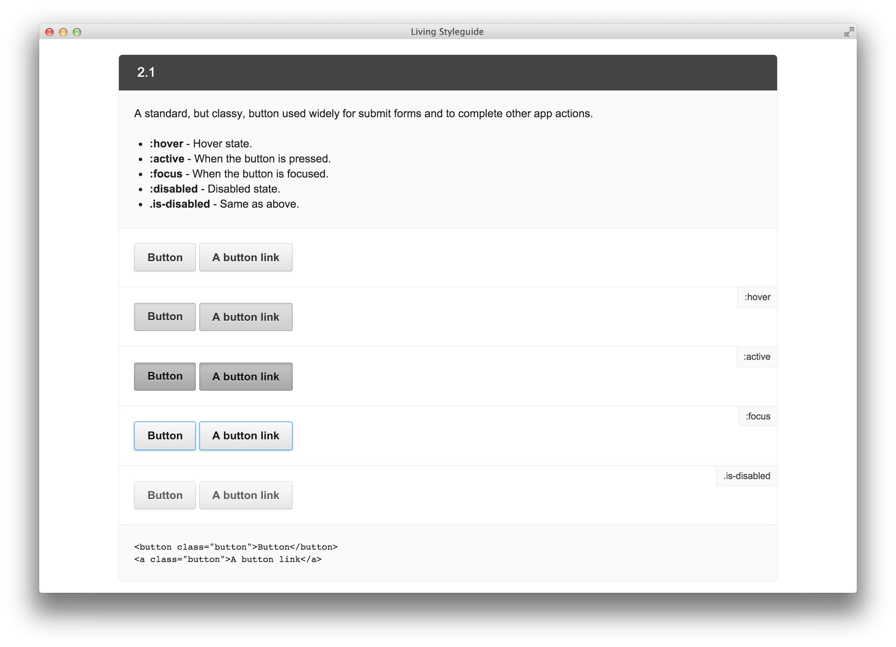

Flask-Styleguide
================

Extension provides an easy way to automatically generate living styleguide
for your application from `KSS documentation <http://warpspire.com/kss/>`_
format.

|Living Styleguide|

.. note::

    KSS is a documentation for humans. It's human readable, machine parsable,
    and easy to remember. `Learn the syntax in less then 5 minutes
    <http://warpspire.com/kss/>`_.

    .. code:: css

        // A standard, but classy, button used widely for submit forms and
        // to complete other app actions.
        //
        // :hover - Hover state.
        // :active - When the button is pressed.
        // :focus - When the button is focused.
        // :disabled - Disabled state.
        // .is-disabled - Same as above.
        //
        // Styleguide 2.1.

.. include:: tutorial.rst
.. include:: contributing.rst
.. include:: changelog.rst

